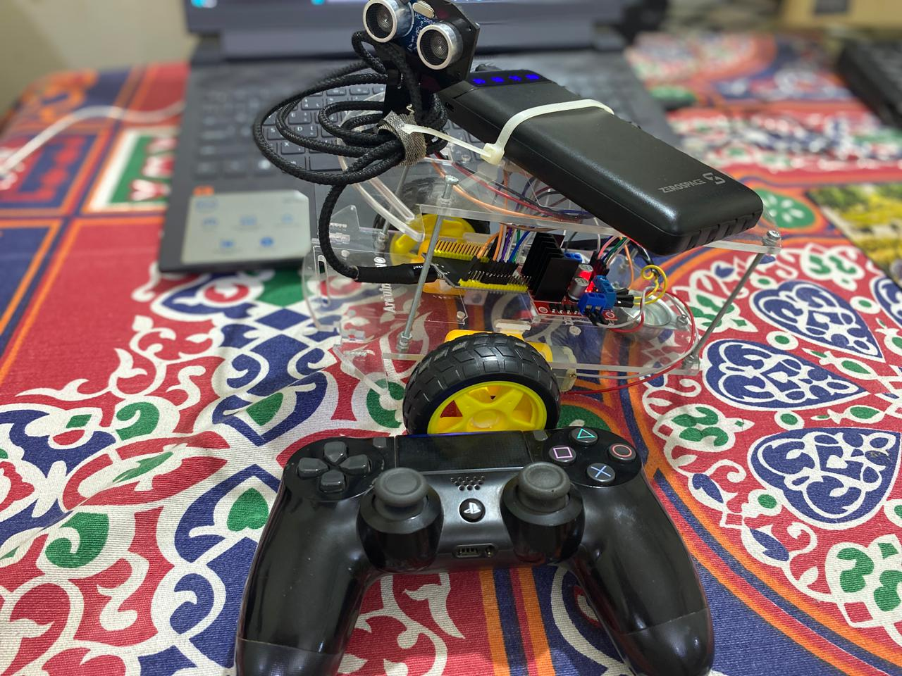

# 🚗 ESP32 + PS4 Controller Car

Control a small robot car using **ESP32** and a **PlayStation 4 Controller** via Bluetooth.

## 📌 Overview
This project connects the ESP32 directly to a PS4 controller over Bluetooth.  
Once connected:
- Use the **Left Stick** to move the car (forward, backward, left, right).  
- If the controller disconnects or the stick is released, the car stops automatically.  
- Calibration factors are included to fine-tune motor speed differences between left and right motors.  

---

## ⚙️ Components
- ESP32 Development Board  
- 2× DC Motors + Motor Driver (L298N / L293D or similar)  
- Battery (e.g., 7.4V Li-ion)  
- Wires + Breadboard or PCB  
- PlayStation 4 Controller (with known MAC address)  

---

## 🔌 Pin Connections

| Motor | ESP32 Pin | Function              |
|-------|-----------|-----------------------|
| ENA   | 33        | Right motor enable (PWM) |
| IN1   | 14        | Right motor input 1   |
| IN2   | 27        | Right motor input 2   |
| ENB   | 12        | Left motor enable (PWM) |
| IN3   | 26        | Left motor input 1    |
| IN4   | 25        | Left motor input 2    |
| LED   | 2         | Status LED            |

---

## 🛠️ Setup
1. Install the [PS4Controller library](https://github.com/aed3/PS4-esp32) in Arduino IDE.  
2. Upload the provided code to your ESP32.  
3. Replace the MAC address in `PS4.begin("xx:xx:xx:xx:xx:xx");` with your controller’s address.  
4. Power up the ESP32 and pair with the PS4 controller.  

---

## 🎮 Controls
- **Left Stick Up** → Move Forward  
- **Left Stick Down** → Move Backward  
- **Left Stick Left** → Turn Left  
- **Left Stick Right** → Turn Right  
- **Neutral** → Stop motors  

---

## 🚦 Features
- Real-time Bluetooth control via PS4 controller  
- Smooth motor speed mapping using joystick position  
- Auto stop when controller disconnects  
- Built-in calibration factors for speed balancing  

---

## 📸 Demo

---

## 📂 Code
The full Arduino sketch is included in this repository.  
