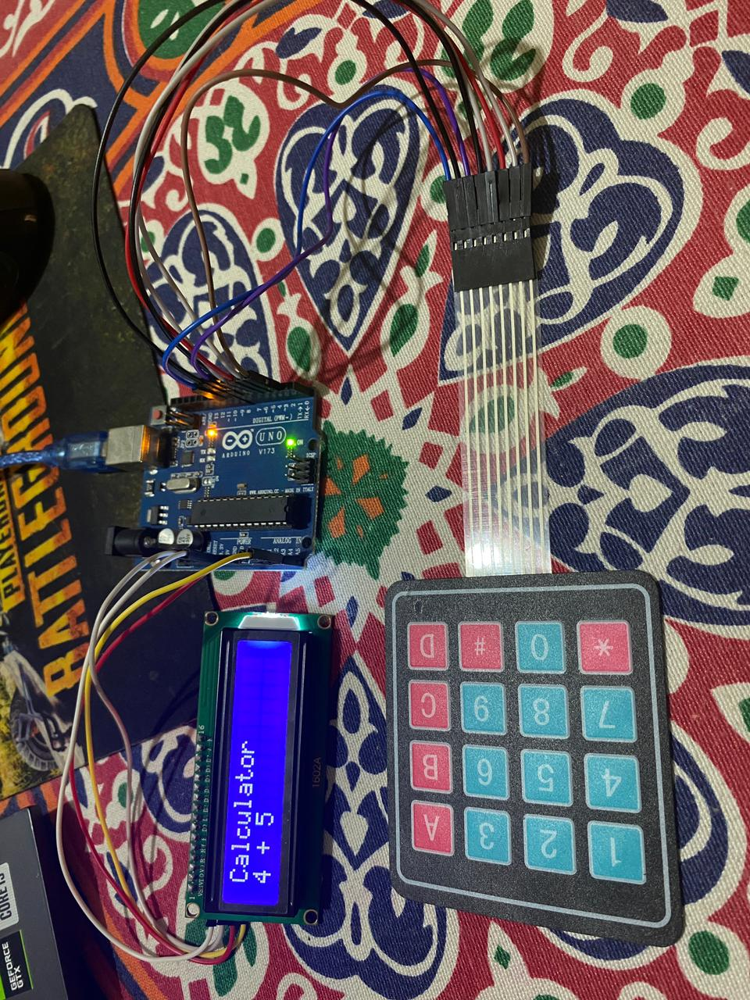

# 🧮 Simple Calculator with Arduino

This project is a simple **calculator** built using **Arduino UNO**, a **4x4 Keypad**, and a **16x2 LCD with I2C**.  
It can perform the four basic arithmetic operations: **addition, subtraction, multiplication, and division**.

---

## 📦 Components
- Arduino UNO
- 4x4 Matrix Keypad
- LCD 16x2 with I2C module
- Jumper wires

---

## 🔌 Connections
- **Keypad Rows** → Pins ** 6 , 7 , 8 , 9**
- **Keypad Columns** → Pins **2 , 3 , 4 , 5**
- **LCD SDA** → A4
- **LCD SCL** → A5
- **Power** → VCC (5V) & GND

---

## ⚙️ How it Works
1. Enter the **first number** using the keypad.  
2. Press an **operator** key (`+`, `-`, `*`, `/`).  
3. Enter the **second number**.  
4. Press `=` → The result will be displayed on the LCD.  
5. Press `C` → To clear/reset and start a new calculation.  

---

## ✨ Features
- Supports **integers only**.  
- LCD displays both the input numbers and the final result.  
- Handles **division by zero** safely (shows `0`).  

---

## 🖼 Example Usage
- Input: `12 + 8 =`  
- Output on LCD: `Result: 20`  

---
📸 Demo

## 👨‍💻 Author
- **Ahmed Mosaafan**  
  Student of Mechatronics Engineering ⚙️  
  Passionate about Robotics & Automation 🤖
