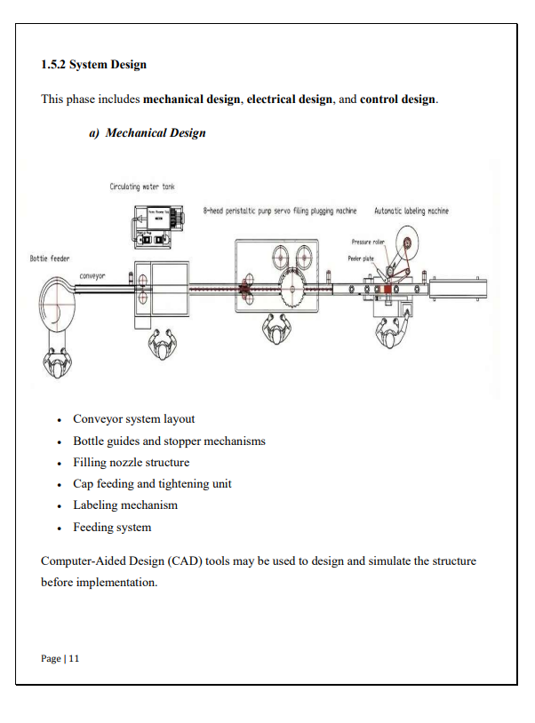
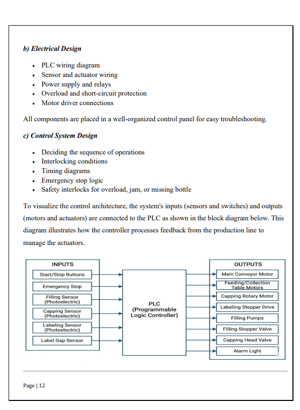

# 🚀 Automated Bottle Filling, Capping & Labeling Machine
### Graduation Project | Mechatronics Engineering (2026)

## 📌 Project Overview
An industrial-scale automated production line designed to optimize the liquid packaging process. The system integrates mechanical design, PLC control logic, and industrial sensing to achieve a seamless, high-speed operation.

> **Status:** 🛠️ Implementation Phase (Ongoing)

## 🛠️ Technical Stack
* **Controller:** Siemens S7-1200 PLC.
* **Programming Software:** Siemens TIA Portal V17/V18.
* **Design Software:** SolidWorks (Full 3D Mechanical Assembly).
* **Languages:** Ladder Logic (LAD) & Structured Control Language (SCL).

## ⚙️ System Architecture
1.  **Conveyor System:** Synchronized bottle movement using AC motors and VFDs.
2.  **Filling Station:** Precise volumetric filling controlled via solenoid valves and flow sensors.
3.  **Capping Station:** Automated torque-controlled capping mechanism.
4.  **Labeling Station:** Photoelectric sensor-triggered labeling system.
## 🛠️ System Design & Control Architecture

### 1. Mechanical Layout (System Overview)

[cite_start]*This diagram shows the complete production line layout, including the bottle feeder, conveyor, and the integrated filling, capping, and labeling stations.* [cite: 171, 172, 175]

### 2. Control Block Diagram (PLC Integration)

[cite_start]*Detailed architecture showing how the Siemens PLC processes inputs from photoelectric and gap sensors to control filling pumps, stepper drives, and actuators.* [cite: 199, 208, 213, 214]

## 🚀 Key Features (In Development)
* **Logic Optimization:** Developing efficient code blocks in TIA Portal for synchronized multitasking.
* **HMI Dashboard:** Real-time monitoring of production rates and system status.
* **Fault Diagnostics:** Integrated alarm system for bottle jams or low fluid levels.

## 📄 Documentation
* [View Full Project Proposal (PDF)](./Project_Documentation.pdf.pdf) 

## 📁 Repository Structure
* `/CAD_Designs`: Includes SolidWorks parts and assembly files.
* `/PLC_Code`: TIA Portal project backups and exported SCL blocks.
* `/Documentation`: Project reports and electrical wiring diagrams.

---
*Developed by [Ahmed saafan and his Team] - Focused on Industrial Automation and Digital Transformation.*
